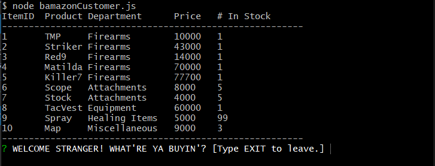
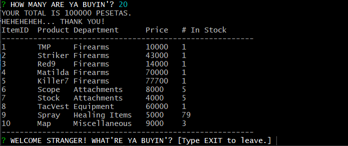
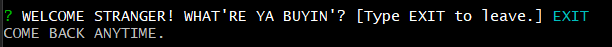

# Bamazon

Bamazon is a simple marketplace app that uses the command line to simulate purchasing items from a fictional store. Its features include a dynamic table to display the storefront using MYSQL as well as an interactive Inquirer prompt that handles the user's purchase requests.

### Prerequisites

Two node packages are required to use this app. They are listed below.


* mysql
* inquirer


### INSTALLATION

```
npm install <package-name>
```

I.E.
```
npm install mysql
```
### PLEASE NOTE

You will need to recall your MYSQL password to access your database through the schema provided. The password must be included in the empty quotation marks within the bamazonCustomer.js file as shown below:

```
var connection = mysql.createConnection({
  host: "localhost",
  port: 3306,
  user: "root",
  password: "", 
          //^ Password Here
  database: "Bamazon"
});

```


### USAGE

CD into the main folder using your terminal. Type "node bamazonCustomer.js" into the command line to initialize the app.

You will be greeted by our friendly merchant, who will ask you what you would like to purchase.

After entering the product name, the merchant will then ask what quantity of the item you would to purchase.

After providing you with your total, the merchant will thank you and ask if you would like to purchase another fine item.

You may exit the app by entering EXIT.

## EXAMPLE ENTRY

* node bamazonCustomer.js



* Spray


* 20



* EXIT 



